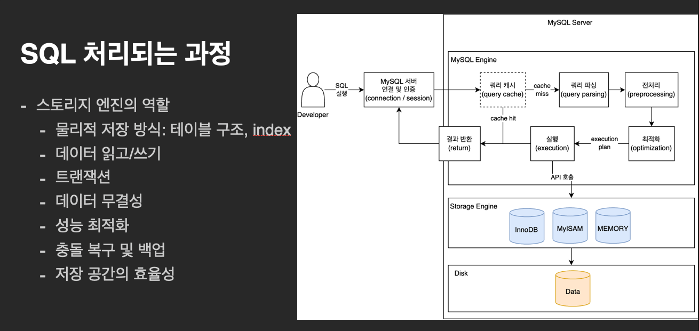
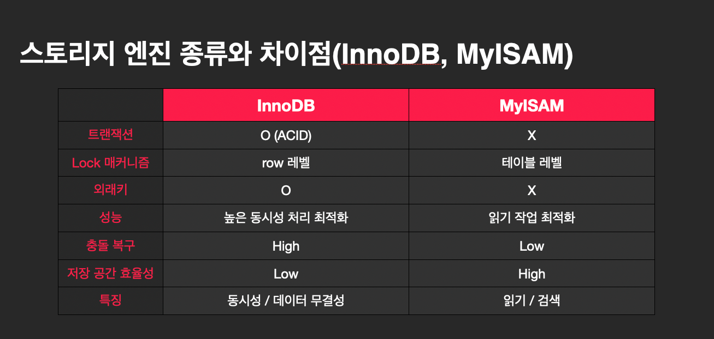
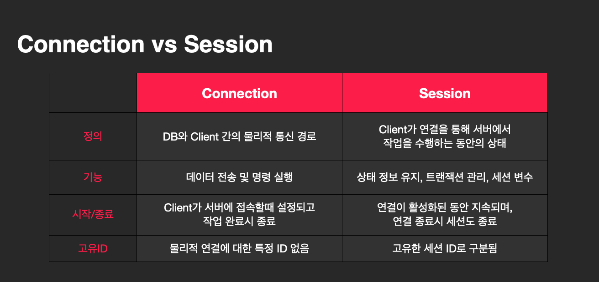
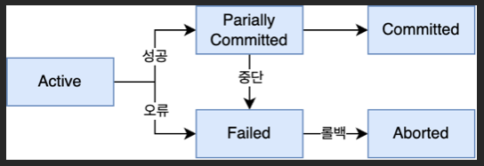
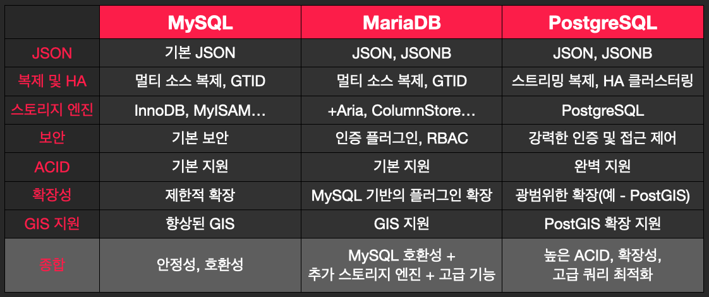
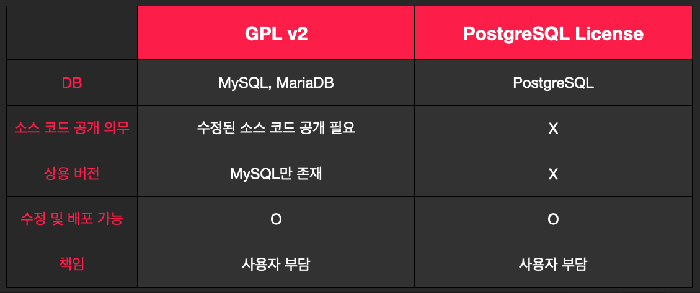

# 2. 초기 프로젝트 세팅을 위한 MySQL 기본

---

## 3. 스토리지 엔진 종류와 차이점 (InnoDB, MyISAM)

---

### SQL 실행 순서

`FROM` -> `JOIN` -> `WHERE` -> `GROUP BY` -> `HAVING` -> `SELECT` -> `DISTINCT` -> `ORDER BY` -> `LIMIT`

```sql
SELECT 
    name, age, sex, COUNT(*), AS cnt
FROM users
JOIN user_profiles
ON users.id = user_profiles.user_id
WHERE age >= 20
GROUP BY age, sex
HAVING COUNT(*) > 0
ORDER BY age DESC
LIMIT 5
```

### SQL 처리되는 과정



- 스토리지 엔진의 역할
  - 물리적 저장 방식: 테이블 구조, index
  - 데이터 읽고/쓰기
  - 트랜잭션
  - 데이터 무결성
  - 성능 최적화
  - 충돌 복구 및 백업
  - 저장 공간의 효율성

### 스토리지 엔진 종류와 차이점(InnoDB, MyISAM)




## 4. charset 과 collation의 종류와 차이점

---

### character set

- 텍스트 데이터를 저장하는 방식
- 데이터베이스(스키마), 테이블, 컬럼 레벨로 정의 가능

- 종류
  - `utf8` : UTF-8 인코딩으로 1~4Byte로 저장되며, 거의 모든 언어를 지원한다
  - `latin1`: ISO-8859-1 인코딩으로 1Byte로 저장되며, 서유럽 언어를 지원한다
  - `ascii`: 7비트 ASCII 인코딩으로 1Byte로 저장되며, 영어 문자만 지원한다

### UTF-8 vs UTF-8mb4

- 유니코드 문자를 인코딩하기 위한 방법
- `UTF-8`
  - 가변 길이의 문자 인코딩 방식으로, 대부분의 문자를 1Byte로, 복잡한 문자는 2~4Byte로 인코딩
  - 하지만 MySQL의 UTF-8은 3Byte 까지만 지원하여 일부 문자를 저장하지 못함
- `UTF-8mb4`
  - MySQL에서 제공하는 확장된 UTF-8 인코딩으로, 유니코드의 4바이트 문자까지 지원
  - 이모지나 동아시아 문자와 같은 모든 유니코드 문자를 완벽하게 지원

### Collation

- 텍스트 데이터를 비교하고 정렬하는 방식
- 종류
  - `utf8_general_ci`: 대소문자를 구분하지 않는 일반적인 UTF-8 정렬
  - `utf8_bin`: 대소문자를 구분하는 이진 비교
  - `utf8_unicode_ci`: 유니코드 코드 표준을 따르는 대소문자 구분 없는 비교

### Character set vs Collation

- `Character Set`
  - 문자들이 어떻게 '저장'되는지
- `Collation`
  - 문자들이 어떻게 '비교/정렬'되는지


## 5. MySQL Driver 종류

---

### MySQL Driver

- MySQL DB에 연결하여 데이터를 주고 받을 수 있게 해주는 소프트웨어
- DB와 Application 사이의 인터페이스 역할

### MySQL Driver 종류

- MySQL Connector/J
  - MySQL와 Java Application 간의 연결을 제공하는 JDBC Driver
- MySQL Connector/ODBC
  - Open Database Connectivity (ODBC) 표준을 지원
  - 다양한 언어와 Application 에서 MySQL에 접근할 수 있도록 제공
- MySQL Connector/Python
  - Python DB API 2.0 표준을 준수
  - Python Application 에서 MySQL에 접근할 수 있도록 제공

### MySQL Driver 선택

- MySQL DB에 연결하여 데이터를 주고 받을 수 있게 해주는 소프트웨어
- DB와 Application 사이의 인터페이스 역할
  - 프로그래밍 언어
  - 프레임워크
  - 운영체제
  - 성능 / 안정성


## 6. connection pool 이란?

---

### connection pool이란?

- 데이터베이스와의 연결을 재사용하여 성능을 향상시키고, 리소스를 효율적으로 관리하는 방식
  - connection pool을 미리 정의하여 생성
  - application에서는 필요할때마다 생성된 pool에서 connection을 가져와서 사용
- connection 생성되는 시간 단축 가능

### connection pool 단점

- 정해진 connection pool 내에서만 사용 가능
- connection이 close되어도 MySQL에선 IDLE 상태로 남아있음
  - connection을 재생성했을때 IDLE 상태의 connection을 주는건 알 수 없음
- connection을 유지해야되는것도 MySQL에선 부담
- MySQL의 reboot되면 connection pool도 재생성 필요
- '쿼리의 크기 제한이 불가능'
  - connection 1개에서 얼마나 큰 규모의 쿼리가 실행되는지 알 수 없음 (실제로 실행해야 알 수 있기 때문)

### connection pool 관련 옵션(자주 쓰는 옵션)

- `maximumPoolSize`: 최대 pool 사이즈
- `minimumIdle`: pool에서 유지할 최소 IDLE pool 사이즈
- `connectionTimeout`: connection을 얻기까지 기다릴 최대 시간
- `idleTimeout`: IDLE connection 이 pool에서 제거되기 전까지의 시간
- `maxLifetime`: pool에서 제거될 시간


## 7. DB세션이란

---

### DB세션(session)이란?

- Connection은 물리적 통신 경로, Session은 connection을 통해 작업을 수행하는 동안의 상태
- 세션은 고유한 ID를 가지고 있음
- 트랜잭션을 시작하고 commit하거나 rollback할때까지 상태를 유지
- 세션 내에서만 사용 가능한 세션 변수가 있음

### Connection vs Session




## 8. 유저 생성 및 권한 관리

---

### 유저 생성 및 삭제

```sql
CREATE USER 'newuser'@'localhost' IDENTIFIED BY 'password';
DROP USER 'newuser'@'localhost';
```

- newuser: 유저 이름
- localhost
  - 유저가 접속할 수 있는 호스트(host)
  - 특정IP나 %를 사용해서 접근할 수 있는 호스트를 제한 가능
- password: 유저 비밀번호

### 권한 부여 및 철회

```sql
GRANT ALL PRIVILEGES ON database_name.* TO 'newuser`@`localhost';
REVOKE ALL PRIVILEGES ON database_name.* FROM 'newuser`@`localhost';
```

- ALL PRIVILEGES
  - 모든 권한 부여
  - 필요에 따라 SELECT, INSERT, UPDATE, DELETE 등의 특정 권한만 부여 가능
- database_name.*
  - 특정 데이터베이스의 모든 테이블에 대해 권한 부여
- `newuser`@`localhost`
  - 권한을 부여할 유저를 지정


## 9. FTS와 index 방식의 차이점

---

### FTS(Full-Text Search)

- 문서, 기사, 블로그 포스트 등의 대량의 텍스트 검색에 사용되는 방식
- 단어의 일부분뿐 아니라 단어의 위치와 빈도를 고려해서 결과를 제공
- 자연어 처리(NLP - Natural Language Processing)와 유사한 기능을 지원하여 관련성이 가장 높은 결과를 반환
- 예시) 구글 검색

```sql
CREATE TABLE articles (
    id    INT AUTO_INCREMENT PRIMARY KEY,
    title VARCHAR(255),
    body  TEXT,
    FULLTEXT (title, body));

SELECT *
FROM articles
WHERE MATCH(title, body) AGAINST('MySQL search' IN NATURAL LANGUAGE MODE);
```

### FTS(Full-Text Search) 장/단점

- 장점
  - 고급 검색: 자연어를 지원하여 복잡한 검색이 가능
  - 연관 검색: 관련성이 높은 결과를 우선적으로 반환
- 단점
  - 추가적인 저장 공간: index를 유지하기 위한 추가적인 저장 공간이 필요함
  - 복잡한 설정: index보다 설정이 복잡함

### index

- 숫자 데이터, 날짜, 그리고 텍스트 데이터에서의 정확한 일치 검색에 사용
- 혹은 데이터를 빠르게 조회하고 정렬하는 데 사용
- 특정 컬럼의 값을 기준으로 데이터의 위치를 빠르게 찾아줌(B-Tree)
- 특정 컬럼에 index를 생성해서 해당 컬럼의 값을 정렬하여 빠르게 검색이 가능함

```sql
CREATE TABLE employees (
    id         INT AUTO_INCREMENT PRIMARY KEY,
    name       VARCHAR(100),
    department VARCHAR(100),
    INDEX (name));

SELECT *
FROM employees
WHERE name = 'gnidoc327';
```

### index 장/단점

- 장점
  - 빠른 검색: 특정 값에 대한 빠른 조회 가능
  - 다양한 데이터 타입: 숫자, 문자열, 날짜 등 다양한 데이터 타입에 대해서 index 생성 가능
- 단점
  - 제한된 검색 기능: 부분 일치나 텍스트 내 검색 기능이 부족
  - 유지 보수 비용: 데이터 변경시 인덱스도 업데이트해야하므로 추가 비용 발생


## 10. explain 명령어를 통한 index 확인 방법 및 최적화

---

### explain 명령어

- MySQL 쿼리 실행 계획을 분석하고 최적화하는 데 사용하는 명령어
- 쿼리가 실행될 때 어떤 방법으로 테이블에 접근하고, 어떤 인덱스를 사용하는지 확인 가능

```sql
EXPLAIN 
SELECT *
FROM employees
WHERE name = 'Tina Scott';
```

### explain 결과 해석

- `select type`: SELECT의 타입(SIMPLE, PRIMARY, UNION, SUBQUERY 등)
- `type`: JOIN의 타입. 성능 최적화에 중요한 요소(ALL, index, rage, ref, NULL 등)
- `possible_keys`: 쿼리에서 사용할 수 있는 index 목록
- `key`: 실제로 선택이 된 index
- `key_len`: 선택된 index의 길이
- `ref`: index된 컬럼과 비교되는 값
- `rows`: 읽을 것으로 예상하는 row 수
- `extra`: 추가적인 정보(Using index, Using where, Using temporary 등)

### index 최적화

- 복합 index 사용
  - 여러 컬럼을 동시에 검색할때는 복합 index 사용
  - name, department 컬럼을 검색할땐 index 1개에서 2개의 컬럼을 모두 사용
- 함수나 연산자를 사용하지 않도록 쿼리 재작성
  - 기존: `SELECT * FROM employees WHERE UPPER(name) = 'gnidoc327';`
  - 최적화: `SELECT * FROM employees WHERE name = 'gnidoc327';`
- 적절한 index 관리
  - explain 결과를 분석해서 불필요한 index는 제거하고 추가가 필요한 index는 생성


## 11. Transaction과 ACID

---

### 트랜잭션(Transaction)

- 트랜잭션은 논리적 작업의 단위로, 하나의 작업 단위를 의미
- 모든 작업이 성공적으로 완료되거나, 전부 취소(롤백)되는 것을 보장
- 트랜잭션은 데이터의 일관성과 무결성을 유지하기 위해 중요
- 예시
  - 은행 송금: 두 작업이 하나의 트랜잭션으로 처리
    - 계좌 A에서 돈을 인출
    - 계좌 B에 돈을 입금
  - 랜(선)뽑(기): 패배 기록이 안남게 경기에서 질거 같으면 인터넷을 끊음

### 트랜잭션의 특징 = ACID

```sql
START TRANSACTION;
UPDATE accounts SET balance = balance - 100 WHERE account_id = 1;
UPDATE accounts SET balance = balance + 100 WHERE account_id = 2;
COMMIT;
```

- Atomicity(원자성)
  - 트랜잭션의 모든 작업이 전부 수행되거나 전혀 수행되지 않음을 보장
  - 실패 시, 모든 변경 사항이 Rollback
- Consistency(일관성)
  - 트랜잭션 실행 전과 실행 후 DB가 일관된 상태를 유지함을 보장
- Isolation(격리성)
  - 트랜잭션이 동시에 실행될 때, 각각의 트랜잭션이 독립적으로 실행되도록 보장
  - 트랜잭션간 간섭 X
- Durability(지속성)
  - 트랜잭션이 성공적으로 완료되면, 그 결과는 영구적으로 저장
  
### 트랜잭션의 상태

- Active: 트랜잭션이 실행 중이며, 아직 완료되지 않은 상태
- Partially Committed: 트랜잭션이 마지막 연산이 실행된 후 모든 변경 사항이 커밋되기 전 상태
- Committed: 트랜잭션이 성공적으로 완료되어 모든 변경 사항이 데이터베이스에 저장된 상태
- Failed: 트랜잭션 중 오류가 발생하여 더 이상 실행을 진행할 수 없는 상태
- Aborted: 트랜잭션이 실패하여 모든 변경 사항이 롤백된 상태



### 트랜잭션 관리

- 로그: 트랜잭션의 변경 사항을 기록해서 장애시 복구
  - `SHOW ENGINE INNODB STATUS;`
- 잠금(Lock) 매커니즘: 동시성 제어로 트랜잭션 간 간섭을 방지
- 체크포인트: 현재 시스템 상태를 저장해서 장애 발생시 체크포인트부터 복구할 수 있도록 구성

### 트랜잭션 관리를 위한 격리 수준

- Read Uncommitted
  - 트랜잭션이 커밋되지 않은 데이터를 읽을 수 있음. 데이터 무결성이 낮음
- Read Committed
  - 트랜잭션이 커밋된 데이터만 읽을 수 있음. 다른 트랜잭션이 중간 변경 사항을 읽을 수 없음
- Repeatable Read
  - 트랜잭션이 시작된 시점의 데이터를 읽으며, 동일한 쿼리를 여러 번 실행해도 동일한 결과를 반환
- Serializable(가장 높은 격리 수준)
  - 트랜잭션이 순차적으로 실행되는 것처럼 동작
  - 동시성 제어를 엄격하게 하여 데이터 무결성을 보장


## 12. DB Lock의 종류와 차이점(LS, LX)

---

### DB Lock

- 여러 트랜잭션이 동시에 동일한 데이터를 엑세스할 때 데이터 무결성을 유지하고 충돌을 방지하는 메커니즘
- 종류
  - 공유 락(LS-Shared Lock)
  - 베타 락(LX-Exclusive Lock)

### 공유 락(LS-Shared Lock)

- 여러 트랜잭션이 동시에 동일한 리소스를 읽을 수 있도록 허용
- 공유 락이 걸린 리소스는 변경할 수 없음
- 데이터 일관성을 유지하기 위해 사용되며 주로 SELECT 쿼리에서 사용

```sql
-- 트랜잭션 1: 공유 락 설정
START TRANSACTION;
SELECT * FROM employees WHERE department = 'HR' LOCK IN SHARE MODE;

-- 트랜잭션 2: 동일 리소스에 대해 공유 락 설정 가능
START TRANSACTION;
SELECT * FROM employees WHERE department = 'HR' LOCK IN SHARE MODE;
```

### 베타 락(LX-Exclusive Lock)

- 특정 리소스에 대해 한 트랜잭션이 베타적으로 액세스하고 변경할 수 있도록 허용
- 베타 락이 걸린 리소스는 다른 트랜잭션이 읽거나 쓸 수 없음
- 데이터 수정시 무결성을 보장하기 위해서 사용되며 주로 UPDATE, DELETE 쿼리에서 사용

```sql
-- 트랜잭션 1: 베타 락 설정
START TRANSACTION;
UPDATE employees SET salary = salary * 1.1 WHERE department = 'HR';

-- 트랜잭션 2: 동일 리소스에 대해 베타 락 시도 (대기 상태)
START TRANSACTION;
UPDATE employees SET salary = salary * 1.2 WHERE department = 'HR'; -- 대기 상태
```

## 13. MySQL, MariaDB, PostgreSQL 기능 비교

---




## 14. MySQL, MariaDB, PostgreSQL 라이센스 비교

---

### MySQL, MariaDB, PostgreSQL 라이센스 비교

- MariaDB, MySQL: GNU General Public License (GPL) v2
  - MySQL: https://github.com/mysql/mysql-server/blob/trunk/LICENSE
  - MariaDB: https://github.com/MariaDB/server?tab=GPL-2.0-1-ov-file
- PostgreSQL: PostgreSQL License
  - https://www.postgresql.org/about/licence/ 

### GNU General Public License (GPL) v2

- 사용자가 소프트웨어를 자유롭게 사용, 수정, 배포할 수 있음
  - 수정된 코드를 배포할 경우 수정된 버전도 GPL v2로 배포
  - Oracle에서는 MySQL의 사용 버전도 제공하지만 MySQL의 상용 버전은 GPL 조건을 따르지 않아 소스 코드 공개 의무가 없음
- 소스 코드 공개 의무
  - 다른 소프트웨어와 결합하여 배포할 경우 수정된 소프트웨어의 소스 코드를 반드시 공개해야 함
- 소프트웨어 제공자에게 법적 책임 부과하지 않음
  - 소프트웨어는 '있는 그대로' 제공되고 사용자는 '그에 따른 위험'을 스스로 감수해야함

### PostgreSQL License

- 사용자가 소프트웨어를 자유롭게 사용, 수정, 배포할 수 있음
- 소프트웨어 제공자에게 법적 책임 부과하지 않음
- 소스코드 비공개 허용
  - 수정된 소프트웨어를 상용 소프트웨어에 포함시키거나 소스 코드를 공개하지 않고 배포 가능
- 재배포 조건
  - 원본 저작권 표시
  - 라이센스 조항과 면책 조항 포함
  - 원본 소프트웨어의 저작권을 유지

### GPL v2 vs PostgreSQL License




## 15. JPA, MyBatis 비교

---

### JPA, MyBatis

- Java Application에서 DB와 상호작용을 위한 프레임워크

### Mybatis

- SQL Mapper 프레임워크
- SQL 쿼리를 XML이나 annotation 으로 정의하여 사용

https://mybatis.org/mybatis-3/ko/getting-started.html

```xml
<?xml version="1.0" encoding="UTF-8" ?>
<!DOCTYPE mapper
  PUBLIC "-//mybatis.org//DTD Mapper 3.0//EN"
  "https://mybatis.org/dtd/mybatis-3-mapper.dtd">
<mapper namespace="org.mybatis.example.BlogMapper">
  <select id="selectBlog" resultType="Blog">
    select * from Blog where id = #{id}
  </select>
</mapper>
```

```java
package org.mybatis.example;
public interface BlogMapper {
  @Select("SELECT * FROM blog WHERE id = #{id}")
  Blog selectBlog(int id);
}
```

### MyBatis - 동적 SQL

https://mybatis.org/mybatis-3/ko/dynamic-sql.html

```xml
<select id="findActiveBlogLike"
     resultType="Blog">
  SELECT * FROM BLOG WHERE state = ‘ACTIVE’
  <if test="title != null">
    AND title like #{title}
  </if>
  <if test="author != null and author.name != null">
    AND author_name like #{author.name}
  </if>
</select>
```

```xml
<select id="selectPostIn" resultType="domain.blog.Post">
  SELECT *
  FROM POST P
  <where>
    <foreach item="item" index="index" collection="list"
        open="ID in (" separator="," close=")" nullable="true">
          #{item}
    </foreach>
  </where>
</select>
```

### MyBatis - 트랜잭션

https://mybatis.org/guice/transactional.html

```java
class CompositeService {

    @Inject
    ServiceA serviceA;

    @Inject
    ServiceB serviceB;

    @Transactional
    public void method() {
        ...
        this.serviceA.method();
        ...
        this.serviceB.method();
        ...
    }

}
```

https://mybatis.org/spring/ko/transactions.html#programmatic-transaction-management

```java
public class UserService {
  private final PlatformTransactionManager transactionManager;
  public UserService(PlatformTransactionManager transactionManager) {
    this.transactionManager = transactionManager;
  }
  public void createUser() {
    TransactionStatus txStatus =
        transactionManager.getTransaction(new DefaultTransactionDefinition());
    try {
      userMapper.insertUser(user);
    } catch (Exception e) {
      transactionManager.rollback(txStatus);
      throw e;
    }
    transactionManager.commit(txStatus);
  }
}
```

### MyBatis 장단점

- 장점
  - 직관적이고 명시적인 SQL 관리
  - 유연성(동적SQL)
- 단점
  - 코드량 증가
    - 반복적인 SQL 코드, Mapper XML 등등
  - Object-Relational 불일치 문제
    - 객체 지향 설계(OOP)와 관계형 DB(RDB) 간의 불일치
  - SQL 지식 필요

### JPA(Java Persistence API)

- Object Relational Mapping(ORM) 표준 API
  - Java EE(Enterprise Edition)의 표준
  - 구현체: Hibernate, EclipseLink
- DB 테이블을 Java 객체로 Mapping 하여 OOP와 RDB 간의 간극을 줄임
- annotation 기반 설정으로 Mapping을 정의(XML 불필요)
- 영속성 컨텍스트
  - 1차 캐시 역할을 하여 DB의 부하를 줄임
  - 지연 로딩(lazy loading)을 통해 필요한 시점에 데이터를 로딩하여 성능 최적화
- JPQL(Java Persistence Query Language): Java 객체를 대상으로 쿼리를 작성

https://docs.spring.io/spring-data/jpa/reference/jpa/getting-started.html

```java
@Entity
class Person {

  @Id @GeneratedValue(strategy = GenerationType.AUTO)
  private Long id;
  private String name;

  // getters and setters omitted for brevity
}

interface PersonRepository extends Repository<Person, Long> {

  Person save(Person person);

  Optional<Person> findById(long id);
}
```

```java
@SpringBootApplication
public class DemoApplication {

  public static void main(String[] args) {
    SpringApplication.run(DemoApplication.class, args);
  }

  @Bean
  CommandLineRunner runner(PersonRepository repository) {
    return args -> {

      Person person = new Person();
      person.setName("John");

      repository.save(person);
      Person saved = repository.findById(person.getId()).orElseThrow(NoSuchElementException::new);
    };
  }
}
```

### JPA(Java Persistence API) - 동적 SQL

https://docs.spring.io/spring-data/jpa/reference/jpa/query-methods.html

```java
@Query("select u from User u where u.firstname like %?#{escape([0])}% escape ?#{escapeCharacter()}")
List<User> findContainingEscaped(String namePart);
```

https://github.com/querydsl/querydsl/tree/master/querydsl-jpa

```java
QCustomer customer = QCustomer.customer;
JPAQuery<?> query = new JPAQuery<Void>(entityManager);
Customer bob = query.select(customer)
  .from(customer)
  .where(customer.firstName.eq("Bob"))
  .fetchOne();
```

### JPA(Java Persistence API) - 트랜잭션

https://docs.spring.io/spring-data/jpa/reference/jpa/transactions.html

```java
@Service
public class UserManagementImpl implements UserManagement {

  private final UserRepository userRepository;
  private final RoleRepository roleRepository;

  public UserManagementImpl(UserRepository userRepository,
    RoleRepository roleRepository) {
    this.userRepository = userRepository;
    this.roleRepository = roleRepository;
  }

  @Transactional
  public void addRoleToAllUsers(String roleName) {

    Role role = roleRepository.findByName(roleName);

    for (User user : userRepository.findAll()) {
      user.addRole(role);
      userRepository.save(user);
    }
  }
}
```

```java
@Transactional(readOnly = true)
interface UserRepository extends JpaRepository<User, Long> {

  List<User> findByLastname(String lastname);

  @Modifying
  @Transactional
  @Query("delete from User u where u.active = false")
  void deleteInactiveUsers();
}
```

### JPA(Java Persistence API) 장단점

- 장점
  - 생산성 향상: 자동화된 CRUD, DB도 이젠 객체지향 설계!
  - 트랜잭션 관리의 자동화: `@Transactional` 사용
  - Entity 간의 관계를 쉽게 관리할 수 있어 1:N, N:1, N:N 관계를 지원함
  - 유연성: Java EE의 표준이므로 다양한 구현체 선택 가능
- 단점
  - 복잡성 증가: 높은 Learning curve. SQL보다 어려운 JPA 쿼리 작성 방식
  - 성능 이슈
    - 의도하지 않는 지연 로딩으로 인해 성능이 느려질 수 있음
    - 대규모 DB 작업시에는 성능 저하가 발생
  - 완전히 해결 할 수 없는 Object-Relational 불일치 문제