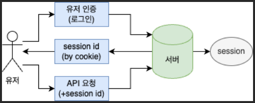
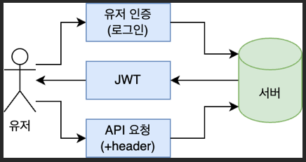

# 3. 유저 기능 개발

---

## 1. JPA 설치 및 설정

- https://docs.spring.io/spring-data/jpa/reference/3.2/repositories/create-instances.html

## 2. 회원 가입 기능 개발

## 3. 회원 탈퇴 기능 개발

## 4. 세션과 토큰 기반 인증 방식의 차이점

---

### 인증(Authentication)

- 인증(Authentication)
  - 시스템에서 사용자나 시스템의 신원을 확인하고, 신원이 유효한지 검증하는 과정
  - 사용자가 자신이 누구인지 증명하는 절차(자격증명)
- 인가(Authorization)
  - 인증된 사용자가 어떤 자원이나 기능에 접근할 수 있는지를 결정하는 과정
- 인증방식
  - SFA - Single Factor Authentication
  - MFA - Multi-Factor Authentication : 2FA(2차 인증)
  - 생체 인식

### 세션(session) 기반 인증

- 서버가 사용자를 인증한 후 세션을 생성하고, 세션 ID를 클라이언트에게 쿠키로 전달한다
- 클라이언트는 이후의 모든 요청에서 이 세션 ID를 서버에 포함시켜 보낸다
- 서버는 세션 ID를 사용하여 서버에 저장된 세션 데이터를 조회하여 사용자를 식별한다

### 세션(session) 기반 인증 - 장점

- 상태 유지: 서버가 세션 데이터를 유지하여 상태 정보를 쉽게 관리 가능
- 단순함: 구현이 간단하고 직관적임
- 보안: 서버가 세션 데이터를 직접 관리하기 때문에 보안에 안정적

### 세션(session) 기반 인증 - 단점

- 상태 유지: 세션 상태를 유지해야되서 scale out(수평 확장)이 어려움
- 부하 증가: 서버 메모리나 저장소에 세션 데이터를 유지해야 하므로 서버에 부하 증가
- 쿠키 의존: 세션ID를 쿠키로 전달하기 때문에 쿠키를 비활성화한 클라이언트는 작동하지 않음

### 토큰 기반 인증

- 서버가 사용자를 인증한 후 JWT(JSON Web Token)와 같은 토큰을 생성하여 클라이언트에게 전달
- 클라이언트는 이후의 모든 요청에 이 토큰을 포함시켜 보낸다(일반적으로 HTTP 헤더에 포함)
- 서버는 토큰을 검증하고, 토큰의 페이로드를 기반으로 사용자를 식별한다

### 토큰 기반 인증 - 장점

- 무상태: 서버가 상태를 유지하지 않으므로 수평 확장이 용이함. 각 요청은 독립적으로 처리
- 확장성: 여러 서버 간에 세션 상태를 공유할 필요가 없어 확장성이 뛰어남
- 유연성: 모바일 앱, SPA(Single Page Application) 등 다양한 클라이언트에서 쉽게 사용 가능
- 자체 인증: 토큰 자체가 사용자의 인증 정보를 포함하고 있어 추가적인 DB 조회 없이 인증을 수행 가능

### 토큰 기반 인증 - 단점

- 보안 취약점
  - 토큰이 클라이언트에 저장되므로, 탈취될 경우 보안 위험이 존재
  - 방지하기 위해 HTTPS를 사용 필수
- 토큰 만료
  - 토큰이 만료되기 전까지는 계속 토큰은 유효
  - 로그아웃 등의 기능을 구현하는 데 어려움이 있을 수 있다
  - 이를 해결하기 위해 리프레시(refresh) 토큰을 사용할 수 있다
- 토큰 크기
  - JWT는 일반적으로 세션 ID보다 크기 때문에 네트워크 대역폭을 더 많이 사용

### JWT (JSON Web Token)

- JSON 형식으로 인코딩된 자가 포함 정보를 가진 토큰
- 세션을 서버에 저장할 필요 없이 무상태(stateless) 인증
- 구성
  - 헤더(header): 토큰 유형과 hashing 알고리즘
    - `{"alg": "HS256", "typ": "JWT"}`
  - 페이로드(payload): 사용자 정보(claim)
    - `{"sub": "1234567890", "name": "John Doe", "lat": 1516239022, "admin": true}`
  - 서명(signature)
    - 헤더와 페이로드를 인코딩한 후 비밀 키를 사용해 생성된 hash 값
    - 서명은 토큰의 무결성을 검증하는데 사용

### JWT (JSON Web Token) - 단점

- 보안 취약점
  - JWT가 클라이언트에 저장되므로, 탈취될 경우 보안 위험이 있음
  - 이를 방지하기 위해 HTTPS를 사용하고, 토큰의 만료 시간을 적절히 설정
- 로그아웃 처리
  - 토큰이 무상태(stateless)이므로 서버에서 강제 로그아웃 등의 기능을 구현하기 어려움
  - 이를 해결하기 위해 블랙리스트를 사용