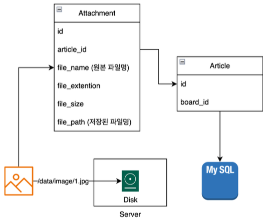
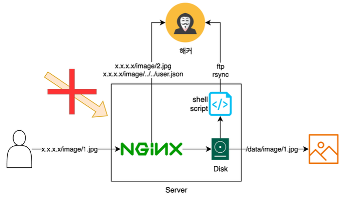
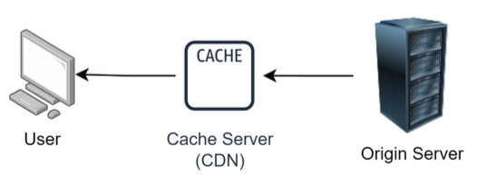
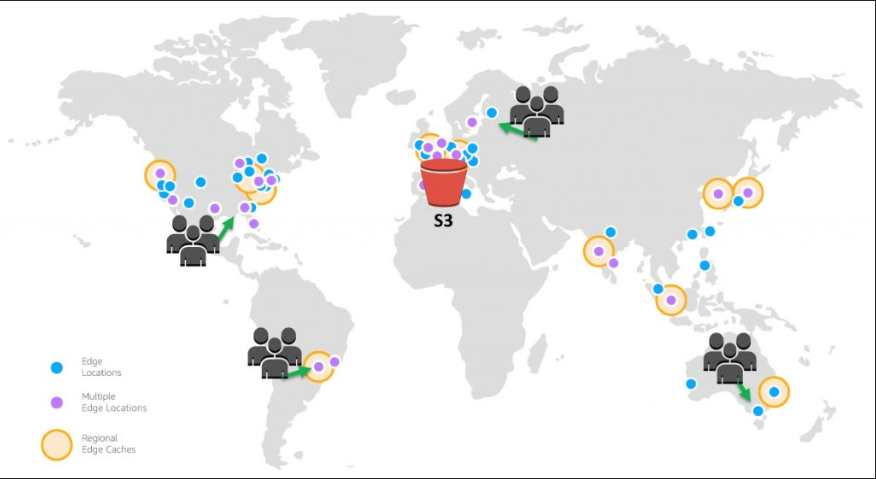
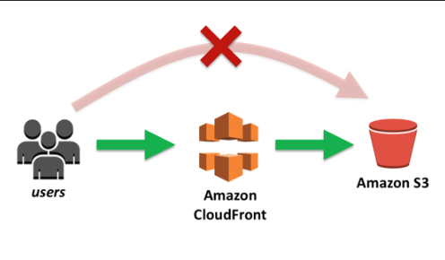
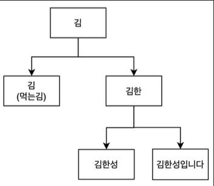
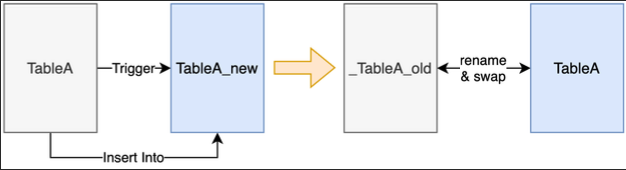

# 4. 게시판 기능 개발

---

## 1. 게시글 작성 기능 개발

---

- 게시판(Board) -> `/boards/{board_id}/articles/{article_id}`
  - 게시글(Article)
    - 댓글(Comment)
    - 첨부파일(Attachment)
  - 클라이언트는 믿을 수 없다!
    - 보안 컨텍스트(Security Context) 활용
  - 반복적인 글 작성 차단
    - 5분에 1번만 작성 가능(rate limit)

## 2. 게시글 조회 기능 개발

---

- 페이징 방식
  - 전체 게시글에 대해서 COUNT 함수 실행 필요
  - 신규 글 / 글 삭제될때 페이지 변경이 잦음
  - 불편한 사용감
- 스크롤 방식
  - 전체 데이터를 노출할 필요 없음
  - 구현 난이도 낮음
  - 직관적이고 모바일에 최적화

## 3. 게시글 수정 기능 개발

---

- 보안 컨텍스트(Security Context) 활용
  - 본인이 작성한 글만 본인이 수정 가능
- 반복적인 글 수정 차단
  - 5분에 1번만 수정 가능(rate limit)

## 4. 게시글 삭제 기능 개발

---

- 보안 컨텍스트(Security Context) 활용
  - 본인이 작성한 글만 본인이 삭제 가능
- 반복적인 글 수정 차단
  - 5분에 1번만 삭제 가능(rate limit)
- Soft Delete(논리 삭제)
  - DB에서 실제로 삭제하지 않고 유저에게만 안보이도록 하는 방식
  - 반대는 Hard Delete(물리 삭제)

### Soft Delete vs Hard Delete

- soft Delete
  - 특정 Flag(is_deleted)를 두는 방식과 특정 테이블(deleted_articles)로 옮기는 방식이 있음
    - 구현 방식은 Flag 가 편리하지만 휴먼 에러로 인해 노출될 가능성이 높음
    - 테이블 방식은 트랜잭션을 고려해야되고 잘못된 트랜잭션으로 인해 더 골치 아플 수 있음
  - 실제로 데이터가 삭제됐을때 부작용이 많아서 대부분 채용하는 방식
- Hard Delete
  - Soft Delete 방식으로 운영하다가 용량을 못버티는 경우(성능, 비용)
  - Data Retention: 개인정보보호법, 위치데이터 등등 보관주기가 정해진 경우

## 5. 댓글 작성 기능 개발

---

- 게시판(Board) -> `/boards/{board_id}/articles/{article_id}/comments`
  - 게시글(Article)
    - 댓글(Comment)
    - 첨부파일(Attachment)
  - 게시판, 게시글이 존재하고 삭제되지 않았는지를 확인하고 댓글이 작성되야함
    - 트랜잭션 처리가 필요!
  - 댓글은 1분에 1번만 작성 가능(rate limit)

## 6. 댓글 조회 기능 개발

---

- 게시판(Board) -> `/boards/{board_id}/articles/{article_id}`
  - 게시글(Article)
    - 댓글(Comment)
    - 첨부파일(Attachment)
- 댓글만 보는 경우는 없기 때문에 게시글 조회시 댓글도 같이 제공
- connection pool을 활용한다면?
  - board, article까진 select / join으로 조회
  - 0.1초라도 빨리 보여주기 위해서 comment 테이블은 별도로 조회

## 7. 댓글 수정 기능 개발

---

- 게시판(Board) -> `/boards/{board_id}/articles/{article_id}/comments/{id}`
  - 게시글(Article)
    - 댓글(Comment)
    - 첨부파일(Attachment)
- 보안 컨텍스트(Security Context) 활용
  - 본인이 작성한 댓글만 본인이 수정 가능
- 반복적인 댓글 수정 차단
  - 1분에 1번만 수정 가능(rate limit)

## 8. 댓글 삭제 기능 개발

---

- 게시판(Board) -> `/boards/{board_id}/articles/{article_id}/comments/{id}`
  - 게시글(Article)
    - 댓글(Comment)
    - 첨부파일(Attachment)
- 보안 컨텍스트(Security Context) 활용
  - 본인이 작성한 댓글만 본인이 삭제 가능
- 반복적인 댓글 삭제 차단
  - 1분에 1번만 삭제 가능(rate limit)

## 9. 대댓글 구현 방식

---

- 게시판(Board)
  - 게시글(Article)
    - 댓글(Comment)
      - 대댓글(Reply, Nested Comment)
    - 첨부파일(Attachment)
- 예시)
- 안녕하세요. 김한성입니다
  - 하이하이
  - 김한성이 누구세요?
- 안녕하세요. gnidoc 입니다
  - 너 김한성이지?


예시)
1. 안녕하세요. 김한성입니다
  - 3) 하이하이 parent_id = 1
  - 5) 김한성이 누구세요? parent_id = 1
2. 안녕하세요. gnidoc 입니다
  - 4) 김한성이지? parent_id = 2

```sql
SELECT * FROM comment
WHERE article = 123
UNION ALL
SELECT * FROM comment
JOIN (
SELECT id FROM comment
WHERE article = 123) AS parent_comment
ON parent_comment.id = comment.parent_id
```

예시) article = 123
1. 안녕하세요. 김한성입니다
  - 3) 하이하이 parent_id = 1
  - 5) 김한성이 누구세요? parent_id = 1
2. 안녕하세요. gnidoc 입니다
  - 4) 김한성이지? parent_id = 2


- 스키마 변경시 2번 작업 필요
- article 기준으론 JOIN 필요
- 조회시 2번의 쿼리 실행이 필요
- 데이터 분산 가능


- 데이터가 커질수록 부담
- 성능 문제(쓰기, index)
- 데이터 무결성 X
- 단일 쿼리로 모든 데이터 조회 가능

## 10. 첨부파일 구현 방식

---



- 게시판(Board)
  - 게시글(Article)
    - 댓글(Comment)
    - 첨부파일(Attachment) -> 애매한 트랜젝션 타이밍
- 제목/내용 + 이미지를 한번에 저장
  - 이미지 저장 실패시 어떻게 해야되는가?
    - 글 작성 실패? / DB 내용만 저장? / 클라이언트에서 retry?
  - 이미지가 너무 큰 경우는?
    - 클라이언트 레벨에서 압축 필요 -> 압축 실패하면?
    - 서버에서도 용량 확인 필요 (클라이언트를 믿지마라!)
  - 하이퍼링크 썸네일(OGTag) 제공을 위해서 더 작은 크기 압축이 필요
    - 썸네일용 이미지와 상세보기에서 노출되는 이미지는 별도로 관리 필요
    - 클라이언트에게 부담? / 서버에서 부담?
- 실제로 글 작성(업로드) 버튼을 누르지 않아도 글이 작성된것처럼 처리
  - 글 작성으로 진입시 제목/내용이 공백인 글을 DB에 저장
  - 첨부파일 업로드가 완료될때 해당 article에 대한 attachment 수정
  - 썸네일 같은 후처리는 비동기 방식으로 처리
    - MQ를 활용한 pub/sub 구조

### 또 다른 문제점 - 파일 업로드를 통한 공격



- 파일명을 `../../`와 같이 로컬 경로로 변경하여 공격
  - 파일확장자를 .log, .ini, .conf, .sh 로 공격
    - nginx - proxy.conf
    - reboot.sh
  - 파일명을 `ftp://x.x.x.x/~~` 식으로 공격

### 해결을 위해선?

- BLOB 타입을 사용해서 DB에 파일을 직접 저장한다
  - 파일 용량이 커질수록 DB에 성능에 영향을 줌
    - 동시 요청자가 많아지면 병목 현상이 발생할 수 있음
- 안전하고 검증된 CDN 서비스를 사용한다
  - AWS CloudFront(+S3)
  - CloudFlare
  - SK브로드밴드, KT, LG U+, 네이버 클라우드 등등

### CDN?



- 지리적 제약 없이 전 세계 사용자들에게 빠르게 콘텐츠를 전송하는 기술
  - Content Delivery Nework
  - Content Distribution Network
- 서비스 제공 업체
  - AWS, GCP, Azure
  - CloudFlare
  - SK브로드밴드, KT, LG U+, 네이버 클라우드 등등

### AWS 예시(CloudFront + S3)

https://aws.amazon.com/ko/blogs/korea/amazon-s3-amazon-cloudfront-a-match-made-in-the-cloud/





### CDN 장/단점
- 장점
  - 병목 현상 해결: 자주 사용되는 컨텐츠의 로딩 속도
  - 트래픽 절약: 해당 지역에 있는 캐시 서버에 접근하기 때문에 국가 단위로 서버 구축 필요X
  - 강력한 보안
- 단점
  - 배포된 컨텐츠에 대한 수정이 사실상 불가능
    - 서버에서 삭제시 실제 캐시 서버에서 바로 삭제된지까지는 알 수 없음
  - 개발/운영 난이도 증가
    - 추가 비용 발생 -> 썸네일 기능 개발, 이미지 저손실 압축 등등

## 11. text type에 대한 index관련 설명

---

- MySQL 5.7에서는 기본적으로 text type에 대해서 index 생성이 불가능함
- 대신 prefix index는 생성이 가능
  - InnoDB에서 text 컬럼의 prefix index 길이는 최대 767Byte까지 지원
  - UTF-8 사용시 최대 3Byte가 필요하므로 최대 255개까지 지정 가능
  - UTF-8mb4 사용시 최대 4Byte가 필요하므로 최대 191개까지 지정 가능

```sql
CREATE TABLE example_table (
  id INT AUTO_INCREMENT PRIMARY KEY,
  content TEXT
) ENGINE=InnoDB;

-- UTF-8 캐릭터셋을 사용하는 경우
CREATE INDEX idx_content ON example_table (content(255));

-- UTF-8mb4 캐릭터셋을 사용하는 경우
CREATE INDEX idx_content_utf8mb4 ON example_table (content(191));
```

### index 크기의 문제



- 일반적인 index는 B-Tree 구조
- 너무 짧으면 대부분 검색이 되지 않아 index를 사용하는 의미가 퇴색될 수 있음
  - 제목은 검색될 수 있지만 글 내용까지는 지원이 불가능
- 너무 길면 index가 큰 공간을 차지할 수 있음
  - index 생성시 디스크 공간을 차지함
  - CRUD 작업시 디스크 IO에 영향을 더 많이 발생 시킴

### FULLTEXT index

- 텍스트 검색을 위해 최적화되어있는 index
  - 텍스트 변경이 빈번할 경우 업데이트되는 비용이 매우 큼
  - 일반 index에 비해서 생성 시간도 더 오래걸리고 저장 공간도 많이 차지함
- `MATCH … AGAINST` 구문으로 사용
- 단어의 빈도와 위치를 고려하여 “관련성”을 평가함
  - 자연어 모드와 부울 모드 지원

## 12. Online DDL을 통한 index 추가

---

### 실제 서비스 중에 스키마 수정이 필요한 경우

- 신규 기능 배포를 위한 컬럼 추가
  - default, nullable 등의 옵션 변경
- 성능 최적화
  - Legacy 컬럼 제거
  - index 추가, 변경, 삭제
- relationship 수정
  - 외래키 추가, 변경, 삭제
  - cascade 추가, 변경, 삭제
- 파티셔닝(partitioning)
- Trigger, Procedure 추가, 변경, 삭제

> 서비스 중단 필수!!

### Online DDL(Data Definition Language)

- 테이블 구조를 변경할 때, 가용성을 유지하며 변경을 수행할 수 있는 기능
- 내장된 기능으로 추가적인 설치나 설정이 필요 없음
- MySQL에서는 InnoDB 를 사용하여 Online DDL 작업을 지원

```sql
ALTER TABLE example_table ADD COLUMN email VARCHAR(255), ALGORITHM=INPLACE, LOCK=NONE;
ALTER TABLE example_table ADD INDEX idx_content (content), ALGORITHM=INPLACE, LOCK=NONE;
ALTER TABLE example_table MODIFY COLUMN content VARCHAR(255), ALGORITHM=INPLACE, LOCK=NONE;
```

- `ALGORITHM`
  - `INPLACE`: 테이블 Lock 없이 온라인으로 작업 수행
  - `COPY`: 테이블 복사본을 생성해서 작업. 테이블 Lock 이 필요할 수 있음
- `LOCK`
  - `NONE`: CRUD 작업 모두 허용
  - `SHARED`: 읽기만 허용
  - `EXCLUSIVE`: 모두 차단

### Online DDL 특징 및 장점

- 비차단 작업
  - 테이블을 변경하는 동안 읽기 / 쓰기 작업 가능
  - 전체 테이블 Lock이 필요 X
    - (일부 작업이나 매우 큰 변경 사항은 Lock 이 발생할 수 있음)
- 효율성
  - 테이블 복사본을 만들지 않고, 필요한 부분만 수정
  - 디스크, 메모리 사용량이 적어 DB 성능에 미치는 영향을 최소화

### Percona Toolkit

- Percona에서 제공하는 MySQL / MariaDB 관리 Tool
- 주요 기능
  - **`pt-online-schema-change`: Online DDL과 비슷한 기능**
  - `pt-table-checksum`: Master/Slave 간의 데이터 무결성을 확인
  - `pt-table-sync`: Master/Slave 간의 데이터 동기화
  - `pt-query-digest`: 쿼리 로그를 분석하여 가장 비용이 많이 드는 쿼리를 분석/최적화

### Percona Toolkit - pt-online-schema-change(pt-osc)



- Online DDL과의 차이점
  - 더 많은 기능과 유연성을 제공하고 대규모/고가용성 환경에서 유용함
    - Online DDL은 복잡한 스키마 변경은 대부분 테이블 Lock이 발생함
    - `ALGORITHM=INPLACE`로 설정시 성능 저하가 발생할 수 있음
  - 작업시 모니터링 가능(예 - progress bar)
  - 테이블을 복사 후 swap하는 방식(Trigger 방식)

### Percona Toolkit 설치

- https://docs.percona.com/percona-toolkit/installation.html
- 맥북 사용자
  - `brew install percona-toolkit`