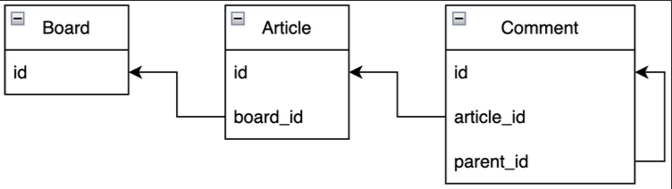
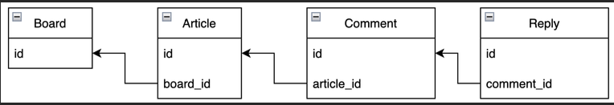
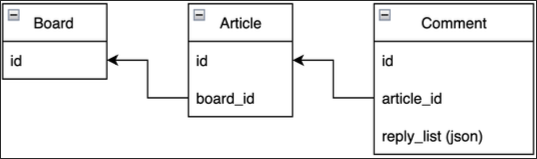

# 4. 게시판 기능 개발

---

## 1. 게시글 작성 기능 개발

---

- 게시판(Board) -> `/boards/{board_id}/articles/{article_id}`
  - 게시글(Article)
    - 댓글(Comment)
    - 첨부파일(Attachment)
  - 클라이언트는 믿을 수 없다!
    - 보안 컨텍스트(Security Context) 활용
  - 반복적인 글 작성 차단
    - 5분에 1번만 작성 가능(rate limit)

## 2. 게시글 조회 기능 개발

---

- 페이징 방식
  - 전체 게시글에 대해서 COUNT 함수 실행 필요
  - 신규 글 / 글 삭제될때 페이지 변경이 잦음
  - 불편한 사용감
- 스크롤 방식
  - 전체 데이터를 노출할 필요 없음
  - 구현 난이도 낮음
  - 직관적이고 모바일에 최적화

## 3. 게시글 수정 기능 개발

---

- 보안 컨텍스트(Security Context) 활용
  - 본인이 작성한 글만 본인이 수정 가능
- 반복적인 글 수정 차단
  - 5분에 1번만 수정 가능(rate limit)

## 4. 게시글 삭제 기능 개발

---

- 보안 컨텍스트(Security Context) 활용
  - 본인이 작성한 글만 본인이 삭제 가능
- 반복적인 글 수정 차단
  - 5분에 1번만 삭제 가능(rate limit)
- Soft Delete(논리 삭제)
  - DB에서 실제로 삭제하지 않고 유저에게만 안보이도록 하는 방식
  - 반대는 Hard Delete(물리 삭제)

### Soft Delete vs Hard Delete

- soft Delete
  - 특정 Flag(is_deleted)를 두는 방식과 특정 테이블(deleted_articles)로 옮기는 방식이 있음
    - 구현 방식은 Flag 가 편리하지만 휴먼 에러로 인해 노출될 가능성이 높음
    - 테이블 방식은 트랜잭션을 고려해야되고 잘못된 트랜잭션으로 인해 더 골치 아플 수 있음
  - 실제로 데이터가 삭제됐을때 부작용이 많아서 대부분 채용하는 방식
- Hard Delete
  - Soft Delete 방식으로 운영하다가 용량을 못버티는 경우(성능, 비용)
  - Data Retention: 개인정보보호법, 위치데이터 등등 보관주기가 정해진 경우

## 5. 댓글 작성 기능 개발

---

- 게시판(Board) -> `/boards/{board_id}/articles/{article_id}/comments`
  - 게시글(Article)
    - 댓글(Comment)
    - 첨부파일(Attachment)
  - 게시판, 게시글이 존재하고 삭제되지 않았는지를 확인하고 댓글이 작성되야함
    - 트랜잭션 처리가 필요!
  - 댓글은 1분에 1번만 작성 가능(rate limit)

## 6. 댓글 조회 기능 개발

---

- 게시판(Board) -> `/boards/{board_id}/articles/{article_id}`
  - 게시글(Article)
    - 댓글(Comment)
    - 첨부파일(Attachment)
- 댓글만 보는 경우는 없기 때문에 게시글 조회시 댓글도 같이 제공
- connection pool을 활용한다면?
  - board, article까진 select / join으로 조회
  - 0.1초라도 빨리 보여주기 위해서 comment 테이블은 별도로 조회

## 7. 댓글 수정 기능 개발

---

- 게시판(Board) -> `/boards/{board_id}/articles/{article_id}/comments/{id}`
  - 게시글(Article)
    - 댓글(Comment)
    - 첨부파일(Attachment)
- 보안 컨텍스트(Security Context) 활용
  - 본인이 작성한 댓글만 본인이 수정 가능
- 반복적인 댓글 수정 차단
  - 1분에 1번만 수정 가능(rate limit)

## 8. 댓글 삭제 기능 개발

---

- 게시판(Board) -> `/boards/{board_id}/articles/{article_id}/comments/{id}`
  - 게시글(Article)
    - 댓글(Comment)
    - 첨부파일(Attachment)
- 보안 컨텍스트(Security Context) 활용
  - 본인이 작성한 댓글만 본인이 삭제 가능
- 반복적인 댓글 삭제 차단
  - 1분에 1번만 삭제 가능(rate limit)

## 9. 대댓글 구현 방식

---

- 게시판(Board)
  - 게시글(Article)
    - 댓글(Comment)
      - 대댓글(Reply, Nested Comment)
    - 첨부파일(Attachment)
- 예시)
- 안녕하세요. 김한성입니다
  - 하이하이
  - 김한성이 누구세요?
- 안녕하세요. gnidoc 입니다
  - 너 김한성이지?



예시)
1. 안녕하세요. 김한성입니다
  - 3) 하이하이 parent_id = 1
  - 5) 김한성이 누구세요? parent_id = 1
2. 안녕하세요. gnidoc 입니다
  - 4) 김한성이지? parent_id = 2

```sql
SELECT * FROM comment
WHERE article = 123
UNION ALL
SELECT * FROM comment
JOIN (
SELECT id FROM comment
WHERE article = 123) AS parent_comment
ON parent_comment.id = comment.parent_id
```

예시) article = 123
1. 안녕하세요. 김한성입니다
  - 3) 하이하이 parent_id = 1
  - 5) 김한성이 누구세요? parent_id = 1
2. 안녕하세요. gnidoc 입니다
  - 4) 김한성이지? parent_id = 2



- 스키마 변경시 2번 작업 필요
- article 기준으론 JOIN 필요
- 조회시 2번의 쿼리 실행이 필요
- 데이터 분산 가능



- 데이터가 커질수록 부담
- 성능 문제(쓰기, index)
- 데이터 무결성 X
- 단일 쿼리로 모든 데이터 조회 가능