# 1. 동접자 1000명 부하를 견디기 위한 ElasticSearch 기본

---

## 1. ElasticSearch 8버전 설치

---

### ElasticSearch
- Apache Lucene
  - Java로 작성된 고성능 full-text 검색 라이브러리
  - 문서를 분석하여 index(색인)을 생성
  - 텍스트는 토큰으로 분할하고 각 토큰의 위치와 빈도를 기록하여 검색을 효율적으로 만듦
  - 검색을 관련성(유사도) 점수로 정렬하여 관련성이 높은 문서를 상위에 표시

- Elasticsearch
  - Lucene을 기반으로 구축된 분산 검색 엔진
  - JSON 기반의 RESTful API를 통해 상호작용
  - 실시간으로 데이터를 처리해서 즉시 검색 가능하도록 제공
  - 다양한 집계 기능(aggregation)

### ELK Stack

- ElasticSearch
  - 역할: 분산 검색 및 분석 엔진.
  - 기능: 대량의 구조화된 및 비구조화된 데이터를 실시간으로 저장, 검색, 분석
- Logstash
  - 역할: 데이터 수집 및 처리 파이프라인
  - 기능: 다양한 소스(서버 로그, 애플리케이션 로그 등)로부터 데이터를 수집, 변환, 전송
         데이터를 Elasticsearch에 저장할 수 있도록 처리
- Kibana
  - 역할: 데이터 시각화 및 대시보드 도구
  - 기능: Elasticsearch에 저장된 데이터를 기반으로 대시보드, 차트, 지도 등을 생성하여 시각화
         실시간으로 데이터 분석과 모니터링이 가능

### ELK Stack (+Beats)

https://www.elastic.co/guide/en/logstash/current/deploying-and-scaling.html#_beats_and_logstash

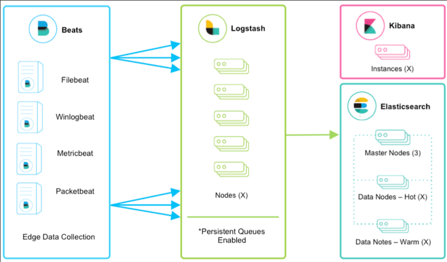

## 2. Datagrip을 통한 접속 방법

---

- https://www.elastic.co/kr/downloads/jdbc-client
- ID: elastic, PW: onion1!
- JDBC 접속을 위해서는 플래티넘 이상의 요금제 구독이 필요

## 3. kibana 란?

---

### kibana 주요 기능

https://www.elastic.co/kr/elastic-stack

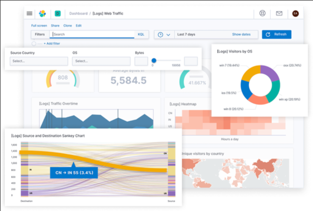

- 데이터 시각화: 차트, 그래프, 지도, 타임라인…
- 대시보드: 차트 활용하여 실시간 데이터 모니터링
- 데이터 탐색(검색): Lucene 와 Kibana Query Language(KQL)를 사용하여 데이터를 검색
- 경보 및 보고서: 대시보드(=차트) 기반 보고서 생성 및 이메일 전송
- Canvas: 사용자 지정 디자인 및 애니메이션을 포함한 인터랙티브한 데이터 시각화

### kibana 활용

- 로그 분석
  - kubernetes, on-premise 서버의 log 및 metric 제공
- 보안 모니터링
  - 네트워크 트래픽, 시스템 로그, 보안 이벤트 등을 모니터링하여 보안 위험 탐지 및 대응
- 운영 업무
  - 서버 및 어플리케이션 리소스 모니터링
  - 비즈니스 데이터(매출, 사용자 행동 등)을 시각화
  - 운영 업무(관리자, CX) 모니터링 -> 당일, 전일(D-1) 조회 수 상위 10위 게시글 리스트 조회

## 4. logstash 란?

---

### logstash 주요 기능

- 데이터 수집 (Input)
  - 입력 플러그인을 통해 여러 소스로부터 데이터를 수집
  - 파일, 데이터베이스, 메시지 큐, 클라우드 서비스 등에서 데이터를 가져올 수 있음
- 데이터 변환 (Filter)
  - 데이터를 변환하고 처리하기 위한 필터 플러그인을 제공
  - 필터는 데이터를 정리, 변환, 구조화하여 분석 가능한 형태로 변경함
- 데이터 출력 (Output)
  - 변환된 데이터를 다양한 출력 플러그인을 통해 전송
  - 일반적인 출력 대상은 Elasticsearch 이지만, 다른 시스템(ex - 파일, HTTP)으로도 전송 가능
- 파이프라인 구성
  - 복잡한 데이터 처리 파이프라인을 구성 가능
  - 여러 입력, 필터, 출력 단계를 결합하여 데이터 흐름(flow)을 정의
  - 각 단계는 독립적으로 구성할 수 있으며, 조건문을 사용하여 특정 조건에 따라 데이터를 처리할 수도 있음

### beats 역할 및 기능

- 경량 에이전트이자 데이터 수집기로, 다양한 소스에서 데이터를 수집하여 Elasticsearch 나 Logstash 로 전송
- 특정 유형의 데이터를 수집하기 위해서 사전 정의된 모듈을 제공 (ex - MySQL, HAProxy, Kafka, AWS…)

### beats 종류

- `Filebeat`: 로그 수집
- `Metricbeat`: 시스템 메트릭(CPU, 메모리, 디스크 사용량) 수집
- `Packetbeat`: 네트워크 트래픽 캡처 및 성능/보안 상태 모니터링
- `Heartbeat`: 웹 서비스, DB 가용성 모니터링
- `Auditbeat`: 시스템 보안 이벤트 수집 및 사용자 활동 추적

## 5. 아키텍처 설명(primary, replica, shard, index, document)

---

### Standalone 모드

- 단일 서버로 운영되는 방식
  - 반대는 Cluster 모드
- 1개의 서버에서 모든 기능을 동작시킴
  - 데이터 저장, 검색, indexing, cluster management

- 장점
  - 설정과 관리가 상대적으로 간단하고 외부 서버와의 통신을 고려할 필요가 없음
- 단점
  - 대규모 데이터 처리가 어려움
  - 고가용성 기능이 없으므로 장애 발생시 서비스 가용성에 영향을 줌

### 클러스터 아키텍처 구조

- Node(노드): 물리/가상 서버
  - Master Node
    - 클러스터 상태 및 모든 노드 관리
    - shard 할당, index 생성
- Data Node
  - 실제 데이터를 저장(CRUD 처리)
  - shard(primary, replica) 저장
- Coordinate Node
  - 검색 요청을 다른 노드에 라우팅(분산)
  - 마스터, 데이터 노드와 직접 상호 작용X

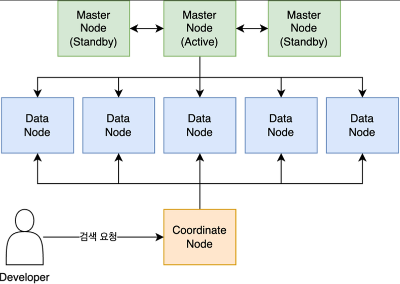

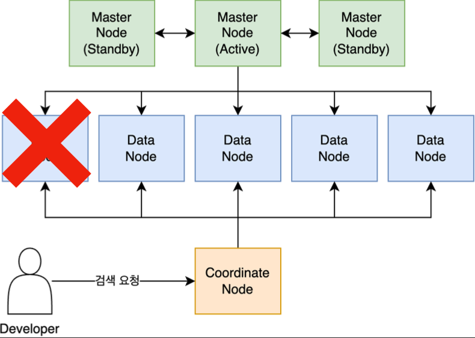

### Shard(샤드)

- Shard
  - index를 구성하는 기본 단위
  - data를 분산 저장하여 데이터 손실을 방지함
  - 특정 node에 병목되지 않도록 분산 처리하기 위함
- 종류
  - primary: 실제로 저장하는 기본 shard
  - replica: primary shard의 복제본
    - 고가용성 및 검색 성능 향상

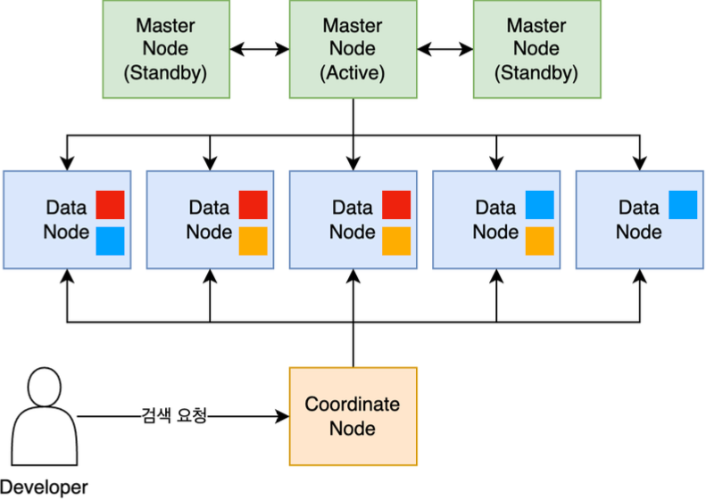

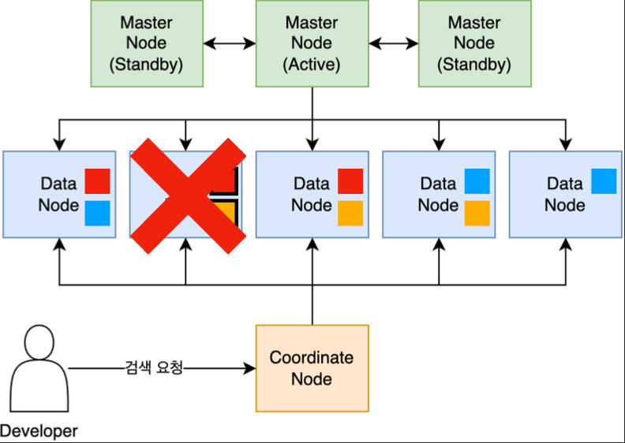

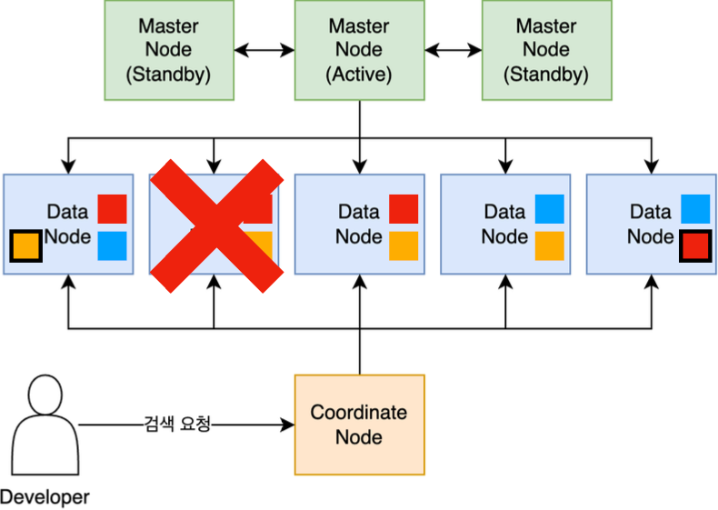

### Shard != replica

- Shard: data를 분산 저장하기 위한 개념
- Replica: shard의 복제본

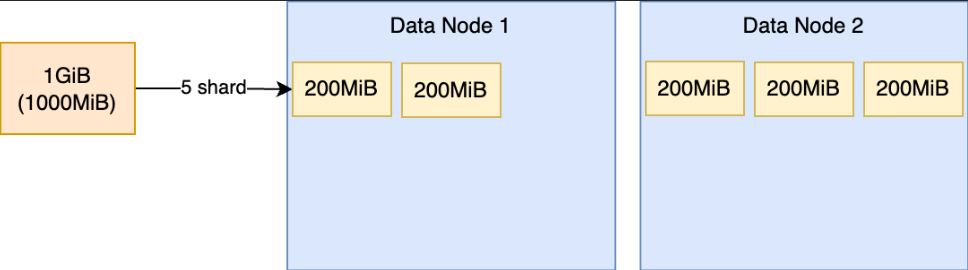

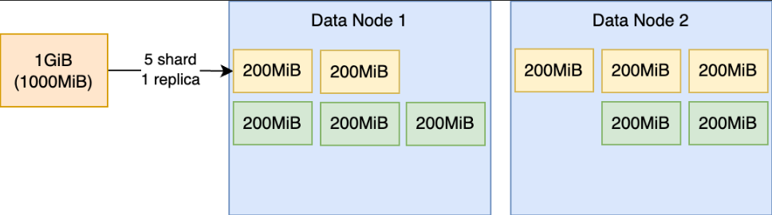

### Document

https://www.elastic.co/guide/en/elasticsearch/reference/current/docs-index_.html

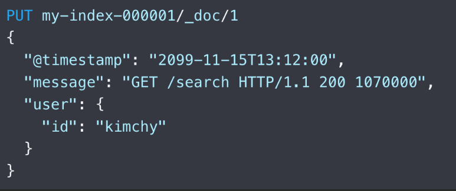

- ElasticSearch에서 가장 작은 단위
- JSON 형식의 데이터
- 지원하는 데이터 타입
  - binary
  - boolean
  - keyword
  - number
  - date
  - object(json)
  - nested(relationship)
  - text

### Index / Type

https://www.elastic.co/guide/en/elasticsearch/reference/current/indices-put-mapping.html

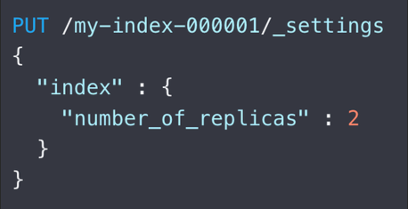

- index(인덱스)
  - data(document)를 저장하는 논리적 단위
  - 각 index는 고유한 이름을 가지고 여러개의 shard로 구성

https://www.elastic.co/guide/en/elasticsearch/reference/7.17/explicit-mapping.html

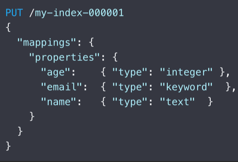

- type(타입)
  - index 내에서 document를 논리적으로 구분하는 단위
  - 하나의 index에서 여러 타입을 정의하기 위해 존재 했었음
  - **7.0부터 type 개념은 deprecation되고 index:type=1:1로 매핑됩니다**

### 데이터 추가(write) 과정

https://www.elastic.co/guide/en/elasticsearch/reference/current/docs-replication.html#basic-write-model

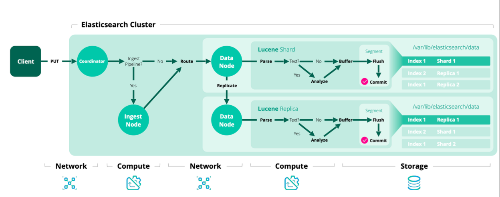