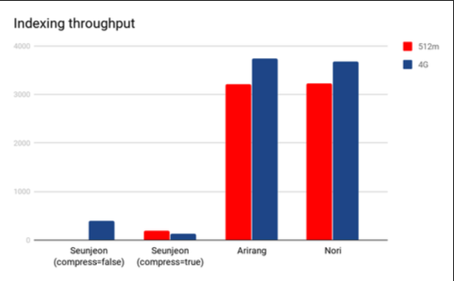
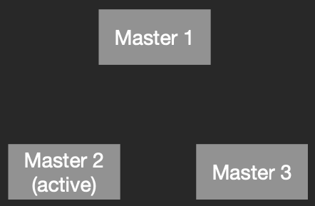

# 1. 동접자 1000명 부하를 견디기 위한 ElasticSearch 기본

---

## 1. ElasticSearch 8버전 설치

---

### ElasticSearch
- Apache Lucene
  - Java로 작성된 고성능 full-text 검색 라이브러리
  - 문서를 분석하여 index(색인)을 생성
  - 텍스트는 토큰으로 분할하고 각 토큰의 위치와 빈도를 기록하여 검색을 효율적으로 만듦
  - 검색을 관련성(유사도) 점수로 정렬하여 관련성이 높은 문서를 상위에 표시

- Elasticsearch
  - Lucene을 기반으로 구축된 분산 검색 엔진
  - JSON 기반의 RESTful API를 통해 상호작용
  - 실시간으로 데이터를 처리해서 즉시 검색 가능하도록 제공
  - 다양한 집계 기능(aggregation)

### ELK Stack

- ElasticSearch
  - 역할: 분산 검색 및 분석 엔진.
  - 기능: 대량의 구조화된 및 비구조화된 데이터를 실시간으로 저장, 검색, 분석
- Logstash
  - 역할: 데이터 수집 및 처리 파이프라인
  - 기능: 다양한 소스(서버 로그, 애플리케이션 로그 등)로부터 데이터를 수집, 변환, 전송
         데이터를 Elasticsearch에 저장할 수 있도록 처리
- Kibana
  - 역할: 데이터 시각화 및 대시보드 도구
  - 기능: Elasticsearch에 저장된 데이터를 기반으로 대시보드, 차트, 지도 등을 생성하여 시각화
         실시간으로 데이터 분석과 모니터링이 가능

### ELK Stack (+Beats)

https://www.elastic.co/guide/en/logstash/current/deploying-and-scaling.html#_beats_and_logstash

## 2. Datagrip을 통한 접속 방법

---

- https://www.elastic.co/kr/downloads/jdbc-client
- ID: elastic, PW: onion1!
- JDBC 접속을 위해서는 플래티넘 이상의 요금제 구독이 필요

## 3. kibana 란?

---

### kibana 주요 기능

https://www.elastic.co/kr/elastic-stack

- 데이터 시각화: 차트, 그래프, 지도, 타임라인…
- 대시보드: 차트 활용하여 실시간 데이터 모니터링
- 데이터 탐색(검색): Lucene 와 Kibana Query Language(KQL)를 사용하여 데이터를 검색
- 경보 및 보고서: 대시보드(=차트) 기반 보고서 생성 및 이메일 전송
- Canvas: 사용자 지정 디자인 및 애니메이션을 포함한 인터랙티브한 데이터 시각화

### kibana 활용

- 로그 분석
  - kubernetes, on-premise 서버의 log 및 metric 제공
- 보안 모니터링
  - 네트워크 트래픽, 시스템 로그, 보안 이벤트 등을 모니터링하여 보안 위험 탐지 및 대응
- 운영 업무
  - 서버 및 어플리케이션 리소스 모니터링
  - 비즈니스 데이터(매출, 사용자 행동 등)을 시각화
  - 운영 업무(관리자, CX) 모니터링 -> 당일, 전일(D-1) 조회 수 상위 10위 게시글 리스트 조회

## 4. logstash 란?

---

### logstash 주요 기능

- 데이터 수집 (Input)
  - 입력 플러그인을 통해 여러 소스로부터 데이터를 수집
  - 파일, 데이터베이스, 메시지 큐, 클라우드 서비스 등에서 데이터를 가져올 수 있음
- 데이터 변환 (Filter)
  - 데이터를 변환하고 처리하기 위한 필터 플러그인을 제공
  - 필터는 데이터를 정리, 변환, 구조화하여 분석 가능한 형태로 변경함
- 데이터 출력 (Output)
  - 변환된 데이터를 다양한 출력 플러그인을 통해 전송
  - 일반적인 출력 대상은 Elasticsearch 이지만, 다른 시스템(ex - 파일, HTTP)으로도 전송 가능
- 파이프라인 구성
  - 복잡한 데이터 처리 파이프라인을 구성 가능
  - 여러 입력, 필터, 출력 단계를 결합하여 데이터 흐름(flow)을 정의
  - 각 단계는 독립적으로 구성할 수 있으며, 조건문을 사용하여 특정 조건에 따라 데이터를 처리할 수도 있음

### beats 역할 및 기능

- 경량 에이전트이자 데이터 수집기로, 다양한 소스에서 데이터를 수집하여 Elasticsearch 나 Logstash 로 전송
- 특정 유형의 데이터를 수집하기 위해서 사전 정의된 모듈을 제공 (ex - MySQL, HAProxy, Kafka, AWS…)

### beats 종류

- `Filebeat`: 로그 수집
- `Metricbeat`: 시스템 메트릭(CPU, 메모리, 디스크 사용량) 수집
- `Packetbeat`: 네트워크 트래픽 캡처 및 성능/보안 상태 모니터링
- `Heartbeat`: 웹 서비스, DB 가용성 모니터링
- `Auditbeat`: 시스템 보안 이벤트 수집 및 사용자 활동 추적

## 5. 아키텍처 설명(primary, replica, shard, index, document)

---

### Standalone 모드

- 단일 서버로 운영되는 방식
  - 반대는 Cluster 모드
- 1개의 서버에서 모든 기능을 동작시킴
  - 데이터 저장, 검색, indexing, cluster management

- 장점
  - 설정과 관리가 상대적으로 간단하고 외부 서버와의 통신을 고려할 필요가 없음
- 단점
  - 대규모 데이터 처리가 어려움
  - 고가용성 기능이 없으므로 장애 발생시 서비스 가용성에 영향을 줌

### 클러스터 아키텍처 구조

- Node(노드): 물리/가상 서버
  - Master Node
    - 클러스터 상태 및 모든 노드 관리
    - shard 할당, index 생성
- Data Node
  - 실제 데이터를 저장(CRUD 처리)
  - shard(primary, replica) 저장
- Coordinate Node
  - 검색 요청을 다른 노드에 라우팅(분산)
  - 마스터, 데이터 노드와 직접 상호 작용X

### Shard(샤드)

- Shard
  - index를 구성하는 기본 단위
  - data를 분산 저장하여 데이터 손실을 방지함
  - 특정 node에 병목되지 않도록 분산 처리하기 위함
- 종류
  - primary: 실제로 저장하는 기본 shard
  - replica: primary shard의 복제본
    - 고가용성 및 검색 성능 향상

### Shard != replica

- Shard: data를 분산 저장하기 위한 개념
- Replica: shard의 복제본

### Document

https://www.elastic.co/guide/en/elasticsearch/reference/current/docs-index_.html

- ElasticSearch에서 가장 작은 단위
- JSON 형식의 데이터
- 지원하는 데이터 타입
  - binary
  - boolean
  - keyword
  - number
  - date
  - object(json)
  - nested(relationship)
  - text

### Index / Type

https://www.elastic.co/guide/en/elasticsearch/reference/current/indices-put-mapping.html

- index(인덱스)
  - data(document)를 저장하는 논리적 단위
  - 각 index는 고유한 이름을 가지고 여러개의 shard로 구성

https://www.elastic.co/guide/en/elasticsearch/reference/7.17/explicit-mapping.html

- type(타입)
  - index 내에서 document를 논리적으로 구분하는 단위
  - 하나의 index에서 여러 타입을 정의하기 위해 존재 했었음
  - **7.0부터 type 개념은 deprecation 되고 index:type=1:1로 매핑됩니다**

### 데이터 추가(write) 과정

https://www.elastic.co/guide/en/elasticsearch/reference/current/docs-replication.html#basic-write-model

## 6. MySQL, ElasticSearch 비교

---

### index 크기의 문제

(챕터4 클립11 - text type에 대한 index 관련 설명)

- 일반적인 index는 B-Tree 구조
- 너무 짧으면 대부분 검색이 되지 않아 index를 사용하는 의미가 퇴색될 수 있음
  - 제목은 검색될 수 있지만 글 내용까지는 지원이 불가능
- 너무 길면 index가 큰 공간을 차지할 수 있음
  - index 생성시 디스크 공간을 차지함
  - CRUD 작업시 디스크 IO에 영향을 더 많이 발생 시킴

### inverted index(역인덱스) 주요 개념

- term: 문서에 등장하는 개별 단어 or 토큰
  - 형태소: 일정한 의미가 있는 가장 작은 말의 단위
- posting list: 특정 term이 등장하는 모든 문서의 리스트. 해당 term의 위치 정보도 포함
- 단어-문서 매핑: 역인덱스는 단어를 key로 해당 단어가 포함된 문서ID의 리스트를 값으로 가지는 매핑을 제공
  
안녕하세요
저는 개발자 김한성입니다
- 안녕하: 형용사
- 시: 선어말 어미
- 어요: 종결 어미
- 저: 대명사
- 는: 보조사
- 개발자: 일반 명사

### 한국어 형태소 분석기

- 형태소 분석기 = 말뭉치 = 사전에 정의된 용어집(사전)

- 공식 한국어 형태소 분석기: nori(노리)
  - https://www.elastic.co/kr/blog/nori-the-official-elasticsearch-plugin-for-korean-language-analysis

### inverted index(역인덱스) 작동 원리

- indexing 과정
  1. 문서가 주어지면 문서를 토큰화(tokenization)
  2. 토큰화된 단어를 역인덱스 구조(posting list)에 추가
  3. 각 단어에 대해 해당 단어가 등장하는 문서와 위치 정보(매핑)를 기록
- 검색 과정
  1. 쿼리 분석
  2. 각 단어에 대해 역인덱스 참조하려 문서 리스트 조회
  3. 여러 단어가 포함된 쿼리는 각 단어의 posting list를 교집합하여 최종 결과를 도출

## 7. ElasticSearch 라이센스 설명

---

- **2021년 이전: Apache 2.0 = 오픈소스**
  - 사용 권한: 누구나 소프트웨어를 자유롭게 사용할 수 있음
  - 배포 권한: 소프트웨어의 원본 또는 수정된 버전을 배포할 수 있음(상업적 배포 포함)
  - 수정 권한: 소프트웨어를 자유롭게 수정할 수 있음. 수정된 버전 배포 가능
- **2021년~: Elastic License v2, SSPL(Server Side Public License) - 이중(dual) 라이센스**
  - **Elastic License v2(ELv2) = 오픈소스 X, 무료 개방형 O**
    - 비상업적 사용 허용: 소프트웨어 무료로 사용 가능. 내부적인 비상업적 사용, 교육, 연구 목적으로 사용 가능
    - 상업적 사용 제한: 소프트웨어를 서비스로 제공하거나, 제품으로 재배포하는 등의 상업적 사용에는 제한이 있음
    - 코드 수정 가능: 소스 코드를 수정하고, 변경 사항을 내부적으로 사용할 수 있습니다
    - 클라우드 서비스 제공 제한: ELv2는 소프트웨어를 기반으로 한 클라우드 서비스 제공을 제한합니다
  - **SSPL**
    - 기본적인 오픈 소스 라이센스와 유사: SSPL은 GPLv3와 유사하게 소스 코드의 사용, 수정, 배포를 허용
    - 클라우드 서비스 제공 제한: 소프트웨어를 서비스로 제공할 때, 소스 코드와 서비스에 관련된 모든 코드 공개 필요
    - 자유로운 사용: 개인적인 용도, 교육, 연구 등 비상업적 목적 사용 가능

https://www.elastic.co/kr/pricing/faq/licensing

https://www.elastic.co/kr/pricing/faq/licensing#summary

https://aws.amazon.com/ko/what-is/opensearch/

### 써도 되나…?

https://www.elastic.co/kr/pricing/faq/licensing#user-how-effect-me

## 8. mapping과 setting

---

### mapping

- document가 저장될때 각 field의 data type을 정의하는 schema
  - `field data type`
    - text, keyword, integer, date, boolean…
  - `analyzer`
    - text field에 대해 어떤 분석기를 사용할 것인지 정의
  - `field property`
    - index, store, doc_values 여부 지정 가능
  - `multiple field`
    - 하나의 text field를 text와 keyword type으로 동시에 indexing 가능

### settings

- index의 동작 방식을 제어하는 설정(shard, replica, analyzer…)
  - `number_of_shards`
    - 데이터를 분할하여 저장하는 단위
  - `number_of_replicas`
    - 데이터의 고가용성을 보장
  - `analysis`
    - 형태소 분석기, 토크나이저, 토큰 필터 등을 정의
  - `refresh_interval`
    - index 갱신 주기. 기본값은 1초

### shard, replica는 얼마나 할당해야할까?

- **shard의 사이즈가 클때**
  - 장점: 한번에 많은 데이터를 처리하므로 검색 indexing / 쿼리 성능이 좋아짐. 오버헤드가 적음
  - 단점: 메모리 사용 증가. 데이터가 고르게 분산되지 않아서 노드 불균형 발생. 백업 및 복구 시간 증가

- **반대로 shard의 사이즈가 작을때**
  - 장점: 클러스터 확장시 유연하게 shard 분산 가능. 노드 간의 부하가 균형있게 분산. 백업 및 복구 시간 감소
  - 단점: shard마다 메타데이터/리소스를 소비하여 오버헤드 증가. 쿼리 성능 저하

- **단일 노드의 경우엔?**
  - shard가 여러개 있어도 물리적인 병렬 처리에 제한(disk 속도, cpu 속도)이 생김

- **replica의 수가 많을때**
  - 장점: 고가용성을 더 많이 보장할 수 있음(데이터 유실에 안전). 읽기 작업을 분산시켜 검색 성능 향상 가능
  - 단점: replica 수만큼 용량이 배로 증가함

- **단일 노드의 경우엔?**
  - 노드 장애시 primary, replica 모두 사용할 수 없기 때문에 고가용성을 보장할 수 없음
  - 단일 노드라고 해도 replica를 통해 읽기 작업을 분산하여 조금은 성능 향상을 기대할 수 있지만 물리적인 한계로 인해 큰 성능 향상은 기대할 수 없음

## 9. 흔하게 겪는 brain split과 re-indexing 문제

---

### brain split 문제

- 클러스터 내의 노드들이 네트워크 분리 또는 기타 장애로 인해 서로 통신할 수 없게 되면서 각 노드가 자신이 마스터 노드라고 잘못 판단하는 현상
  - 분산 시스템, 특히 클러스터 환경에서 발생할 수 있는 문제
  - 일부 노드들이 서로 통신할 수 없게 되어 각 노드가 자신이 마스터라고 잘못 판단할 때 발생
  - 데이터 일관성 문제와 클러스터의 안정성 저하를 초래
  - 최악의 경우, 시스템 복구 불가능 초래

### brain split 문제 방지를 위한 설정

- **Master Node는 홀수개로 구성**
- **Minimum Master Nodes 설정**
  - 클러스터가 최소 몇 개의 마스터 노드와 통신할 수 있어야 정상적으로 작동할지를 정의
  - 이 설정을 통해 클러스터가 여러 개의 마스터 노드를 생성하는 것을 방지
  - 예) discovery.zen.minimum_master_nodes: 2
- **Zen Discovery**
  - 클러스터 내의 노드들이 서로를 발견하고, 통신을 관리하며, 네트워크 분리를 감지하여 Brain Split 문제를 방지

### re-indexing 문제

- **setting, mapping를 변경해야되는 상황**
  - shard, replica, field type, dictionary, analyzer 변경
- **ElasticSearch Cluster 버전 업그레이드**
  - 호환성을 위해서 데이터를 다시 `indexing` 해야하는 경우가 있음
- **성능 최적화**
  - 데이터 구조 최적화, 삭제된 문서 처리, 불필요한 데이터 제거
  - analyzer 최적화, 데이터 볼륨 증가

### re-indexing 이 필요한 경우

- **rolling re-indexing**
  - 기존 `index`는 유지하고 새로운 `index`를 생성하여 점진적으로 데이터를 복사
  - 끝난 뒤에 application이 새로운 `index`를 참조하도록 변경
- **일괄 처리**
  - 데이터 세트를 여러개의 작은 배치로 나눠서 성능 저하를 최소화하여 진행
- **re-index API 사용**
  - 편하긴 하지만 `mapping`이 잘못되어 field 타입이나 이름이 충돌나면 오류가 발생할 수 있음
  - 문제가 발생했을때 원인 파악이 쉽지 않음

### re-indexing 중 자주 발생하는 문제

- **리소스 소모로 인한 클러스터 성능 저하**
  - 일부 노드에 과부하가 걸려서 장애가 발생할 수 있음
  - CPU, 메모리, Disk I/O, Network 등등 전반적인 노드 상태 확인이 필요
  - 작업속도에 제한을 걸면 성능엔 덜 영향을 주지만 작업 완료시간이 기약없이 길어질 수 있음
- **데이터 일관성**
  - 설정을 잘못하거나 중단된 re-indexing 작업으로 인해 중복 데이터가 생기거나 손실될 수 있음
  - 부분적으로 `re-indexing`을 하여 전체가 아닌 변경된 데이터 세트만 `re-indexing`을 할 수 있음
- **백업 및 복구**
  - 백업을 위한 스냅샷을 생성하다가 클러스터 성능 저하가 발생하거나 장애가 발생할 수 있음